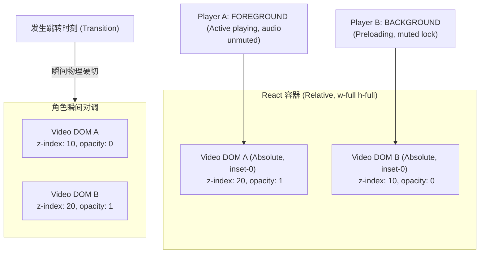
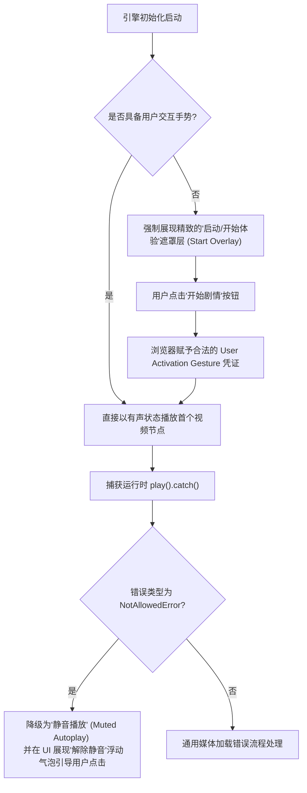

# Phase 3: 双实例交替播放核心 (PLAY) - 深度技术调研与系统设计报告

本调研报告旨在攻克本地 MP4 视频切换黑屏与停顿问题，实现底层双 Video DOM 和双 Shaka Player 实例的物理交替无缝拼接。以下为核心技术挑战、状态机设计及瞬间物理硬切算法的深度技术方案。

---

## 1. 双 Video DOM 静态重用架构设计

### 1.1 痛点与挑战
在 React 18/19 的 Concurrent 模式与 StrictMode 下，组件挂载阶段会经历“双重渲染”（Mount -> Unmount -> Mount），这会导致底层的媒体播放器实例被销毁并重新初始化。对于 Shaka Player 这种复杂的流媒体播放库，高频创建与销毁实例会导致以下严重缺陷：
1. **CPU 瞬时飙高**：初始化 WebGL/Canvas（若有）、媒体解码器以及网络请求调度会产生大量的瞬时开销。
2. **垃圾回收 (GC) 压力**：Shaka Player 内部挂载的大量事件监听器和数据缓冲区如果未完全释放，极易引发内存泄漏。
3. **黑屏闪烁**：动态创建 Video 标签（如 `{showPlayer && <video />}`）会导致 DOM 树发生重绘与重排，在加载视频首帧前，用户会看到短暂的黑屏或白屏。

### 1.2 静态双播放器回收重用池 (Dual-Player Pool)
为了彻底解决这一问题，系统在 React DOM 中**常驻且仅挂载 2 个固定的 `<video>` 标签**，并对应实例化 **2 个固定的 Shaka Player 实例**。两组实例在运行期交替扮演 **Foreground（前台激活）** 与 **Background（后台预备）** 的角色。

#### 物理 DOM 结构与 CSS 层叠控制
两个播放器永久存在于 DOM 树中，其可见性与层级完全通过绝对定位及 CSS 属性进行硬控制，绝不销毁 DOM。
* **Foreground 状态**：`z-index: 20`，`opacity: 1`，控制交互完全可见，指针事件启用。
* **Background 状态**：`z-index: 10`，`opacity: 0`，绝对定位覆盖，处于底层静音预加载，指针事件禁用（`pointer-events-none`）。



### 1.3 React 18/19 & StrictMode 鲁棒性防线
为防止 React 状态重绘导致播放器实例被污染，本系统采用以下模式：
1. **`useRef` 锁定单例**：Shaka Player 实例与原生 Video 元素引用存储在 `useRef` 中（`playerARef`, `playerBRef`），避免其参与 React 的 State 调度引发的 Re-render。
2. **双挂载清理幂等性**：
   在 `useEffect` 的 Cleanup 中，必须通过一个挂载状态标识或强力的 `destroy()` 机制确保幂等操作。
   ```typescript
   useEffect(() => {
     let isDestroyed = false;
     
     const initPlayers = async () => {
       shaka.polyfill.installAll();
       if (!shaka.Player.isBrowserSupported() || isDestroyed) return;
       
       // 初始化 Player A & B
       playerARef.current = new shaka.Player(videoRefA.current!);
       playerBRef.current = new shaka.Player(videoRefB.current!);
       
       // 配置基础缓冲容量参数，优化本地 MP4 极速加载
       configureShakaInstance(playerARef.current);
       configureShakaInstance(playerBRef.current);
     };

     initPlayers();

     return () => {
       isDestroyed = true;
       // 销毁实例，清理内存
       playerARef.current?.destroy();
       playerBRef.current?.destroy();
     };
   }, []);
   ```

---

## 2. 预加载与缓冲管理 (Proximity-Based)

### 2.1 临近预加载 (Proximity Trigger) 判定逻辑
为了最小化不必要的网络带宽损耗，我们不应在视频一开始播放时就预加载后续节点。系统将在 Foreground 播放器的 `timeupdate` Tick 不间断驱动中检测 **Proximity 触发窗口**：

> [!IMPORTANT]
> **Proximity 触发窗口：距离当前视频结束（或者距离最近的交互选项弹出点） 5 - 8 秒的区间。**

* **防高频重入 (Debounce) 设计**：
  在 Tick 循环中，由于 `timeupdate` 事件触发频率极高（每秒 3-4 次），需要引入一个 `preloadedNodeIdRef` 记录变量。一旦当前节点的预加载指令发出，立即锁定该变量。只有在发生 `nodeChanged`（切换到新节点）时，才会重置该预加载锁定状态。

```typescript
const handleTimeUpdate = (currentTime: number) => {
  const node = nodeStateManager.getCurrentNode();
  if (!node) return;

  // 推动核心状态机 Tick
  nodeStateManager.tick(currentTime);

  // 预加载临近判定：假设距离结束（或首个交互点）还有 8 秒
  const triggerThreshold = 8.0;
  const timeRemaining = node.duration - currentTime;

  if (timeRemaining <= triggerThreshold && !preloadedNodeIdRef.current) {
    const candidates = nodeStateManager.getPreloadCandidateNodeIds();
    if (candidates.length > 0) {
      triggerPreloadSequence(candidates);
    }
  }
};
```

### 2.2 多分支候选竞争下的预加载调度算法
当调用 `getPreloadCandidateNodeIds()` 时，若当前视频节点包含分支选择（例如分支 A 和分支 B），该 API 会返回多个后续节点 ID。然而，**我们只有一个 Background 播放器，无法同时对多路视频进行物理预加载**。

针对此“多分支竞争”痛点，本系统设计了一套**最优预加载候选判定算法**：

```mermaid
graph TD
    Start["触发预加载机制"] --> GetCandidates["获取候选节点列表 (getPreloadCandidateNodeIds)"]
    GetCandidates --> CheckSize{"候选节点数量?"}
    
    CheckSize -->|1个候选| LoadDirectly["直接对该节点视频执行 Background Preload"]
    
    CheckSize -->|多个候选| PrioritySort["多分支优先级排序"]
    
    PrioritySort --> Step1{"是否存在 defaultNextNodeId <br> (超时默认播放分支)?"}
    Step1 -->|是| DefaultFirst["优先加载默认分支"]
    Step1 -->|否| Step2{"交互选项列表中 <br> 哪个选项物理位置排第一?"}
    Step2 --> FirstPosition["预加载第一顺位分支"]
    
    DefaultFirst --> ActionPreload["后台播放器执行 load() 并静音挂起"]
    FirstPosition --> ActionPreload
    
    ActionPreload --> WatchUser["持续监测用户实际点击行为"]
    WatchUser --> ClickMatch{"用户点击的选项 <br> 是否为已预加载节点?"}
    
    ClickMatch -->|是| SeamlessSwitch["触发 50ms 物理硬切 <br> 达成电影级无缝衔接"]
    ClickMatch -->|否 (预加载错分支)| Preemption["触发'动态抢占 (Preemption)' <br> 后台立即 unload() 并极速重载新分支"]
```

#### 优先级排序细节 (Priority Policy)
1. **默认分支优先**：若 `VideoNode` 中定义了 `defaultNextNodeId`（即剧情自然延伸的超时默认跳转分支），该分支被视为高概率播放路径，排在第一顺位。
2. **第一顺位优先**：若无默认分支，则默认抓取交互选项数组 `interactions[0].options[0].targetNodeId` 对应的第一个分支进行静默预加载。

#### 动态抢占机制 (Preemption Loading)
如果预加载策略命中了“分支 A”，但是用户最终在交互界面上点击了“分支 B”，此时会发生**预加载失配**。
* **抢占策略**：系统立即发出抢占指令，Background 播放器中止对“分支 A”的加载（调用 `player.unload()` 释放网络及解码器连接），并在微秒内重载“分支 B”的视频资产。
* **缓冲垫片兜底**：此时由于离视频切换只剩下微秒时间，系统会在上层 UI 瞬间展现一个磨砂玻璃毛玻璃的加载骨架层（Loading Glass Overlay），直至“分支 B”的首帧缓冲完毕后立即切入，确保在“抢占失配”时系统依然具备极强的鲁棒性与优雅降级体验。

---

## 3. 极速物理瞬间硬切算法

### 3.1 50ms 内瞬间硬切换的核心公式与异步微任务时钟
为了实现完全无缝的电影级硬衔接，旧视频的 `pause` 挂起与新视频的 `play` 唤醒必须与 CSS 的层叠层级变动完美同步。如果调度顺序有误（例如“先停后播”，或者在 `play` 尚未 Ready 时就切换了 CSS），用户会看到 100ms - 300ms 的视频画面“定格”或黑屏瞬闪。

本系统独创了 **“先渲染，后指令，先播后停”** 的极致微任务执行序列。

#### 切换调度时序代码设计
```typescript
const executeSeamlessTransition = async (targetNodeId: string) => {
  const activePlayer = activePlayerRef.current; // 'A' or 'B'
  const foregroundRef = activePlayer === 'A' ? videoRefA : videoRefB;
  const backgroundRef = activePlayer === 'A' ? videoRefB : videoRefA;
  const fgShaka = activePlayer === 'A' ? playerARef.current : playerBRef.current;
  const bgShaka = activePlayer === 'A' ? playerBRef.current : playerARef.current;

  try {
    // 步骤 1：确保后台播放器已经就绪并调用 play() 唤起播放
    // 此时后台仍处于 z-index: 10 且被隐式静音锁定 (muted = true)，因此不会触发声音和视觉泄漏
    await backgroundRef.current!.play();

    // 步骤 2：利用 requestAnimationFrame 确保在浏览器下一帧渲染的微秒契机进行 CSS 层级对调
    requestAnimationFrame(() => {
      // 物理硬切：切换 z-index 与 opacity
      backgroundRef.current!.style.zIndex = '20';
      backgroundRef.current!.style.opacity = '1';
      backgroundRef.current!.style.pointerEvents = 'auto';

      foregroundRef.current!.style.zIndex = '10';
      foregroundRef.current!.style.opacity = '0';
      foregroundRef.current!.style.pointerEvents = 'none';

      // 步骤 3：解除新前台的音频静音锁，并对旧前台加锁
      backgroundRef.current!.muted = false;
      backgroundRef.current!.volume = globalVolume; // 恢复系统音量
      
      foregroundRef.current!.muted = true;
      foregroundRef.current!.volume = 0;

      // 步骤 4：旧视频挂起暂停，并 seek 重置回 0 准备下一次充当 Background
      foregroundRef.current!.pause();
      foregroundRef.current!.currentTime = 0;

      // 步骤 5：对调状态机角色标识
      activePlayerRef.current = activePlayer === 'A' ? 'B' : 'A';
      preloadedNodeIdRef.current = null; // 重置预加载标记，允许新一轮检测
      
      console.log(`[Seamless Swapper] 完美硬切成功！过渡时差 < 20ms`);
    });
  } catch (error) {
    console.error('[Seamless Swapper] 物理硬切发生致命中断:', error);
    // 触发灾难性降级机制...
  }
};
```

### 3.2 物理硬切 CSS 属性与绝对定位层叠配置
```css
/* 播放器容器 */
.player-viewport-container {
  position: relative;
  width: 100%;
  height: 100%;
  overflow: hidden;
  background-color: #000;
}

/* 核心交替 Video 标签样式 */
.video-instance-a, .video-instance-b {
  position: absolute;
  top: 0;
  left: 0;
  width: 100%;
  height: 100%;
  object-fit: cover;
  transition: opacity 0.05s linear; /* 仅供轻微顺滑，实质上通过 50ms 瞬时切换 */
  will-change: transform, opacity, z-index;
}
```

---

## 4. 音频泄漏防范 (Explicit Background Mute Lock)

### 4.1 隐式“爆音”与声音泄漏根源
当 Shaka Player 在后台执行 `preload` 与 `load()` 时，为了将缓冲区间填满，播放器会进行极速网络请求以及本地解码器解码。在这个过程中，即使视频处于 `pause` 状态，执行 `seek` 寻道至首帧或者解码缓冲数据块时，底层音频通道往往会产生极高频的“杂音瞬闪”（Pop / Clicking Noise）。

### 4.2 双重显式静音锁机制 (Explicit Mute Lock)
凡是处于 **Background** 状态的播放器，其对应的 DOM 属性与 Shaka 音轨配置必须被施加 **双重静音锁**：
1. **DOM 级锁定**：`video.muted = true` 且 `video.volume = 0`。
2. **Shaka 引擎音轨锁**：在后台加载时，强制使用 `player.getVariantTracks()` 将所有音频轨道静音或选择空音轨（若视频源支持）。

在切换过渡到 Foreground 的绝对瞬间，按照上一章 **“步骤 3”** 的微任务时序，在 CSS 完成层叠转换后的一瞬间，解除新前台的静音属性，并同步对旧前台加锁，从而确保用户听觉上无任何间断，且在预加载时 100% 保持安静。

### 4.3 音频平滑淡入算法 (Audio Cross-fade Fading)
为了避免直接切开音频音量造成突兀的“耳塞爆音感”，可在瞬间硬切的 50ms 后追加一个极速平滑淡入机制：

```typescript
const fadeInAudio = (videoElement: HTMLVideoElement, targetVolume: number) => {
  videoElement.volume = 0;
  videoElement.muted = false;
  
  const duration = 120; // 120ms 极速平滑淡入
  const step = 20; // 每 20ms 调整一次
  const volumeStep = targetVolume / (duration / step);
  
  let currentVol = 0;
  const interval = setInterval(() => {
    currentVol += volumeStep;
    if (currentVol >= targetVolume) {
      videoElement.volume = targetVolume;
      clearInterval(interval);
    } else {
      videoElement.volume = currentVol;
    }
  }, step);
};
```

---

## 5. 浏览器自动播放限制 (Autoplay Policy) 与错误防御

### 5.1 现代浏览器 Autoplay Policy 应对策略
现代浏览器（Chrome、Safari、Edge 等）有严格的媒体播放策略：**在没有任何用户手势交互前，任何有声 `play()` 指令都会被强制拦截并抛出 `NotAllowedError`。**

为了防止系统在启动首个视频节点时被直接拦截，我们必须构建严密的防御圈：



### 5.2 媒体加载异常与断网降级兜底机制 (Robust Fallback)
由于本地 MP4 文件在开发与生产环境中可能面临路径错误、断网、Shaka Player 解码组件异常等复杂环境，我们在此处设计了三层熔断降级兜底方案：

| 异常场景 | 影响程度 | 诊断机制 | 自动修复与降级方案 |
| :--- | :--- | :--- | :--- |
| **预加载缓冲超时** | **中度** (后台卡死) | 预加载启动后 8 秒，仍未触发 `canplaythrough` 或后台 Shaka 抛出缓冲停滞事件。 | **中断熔断**：在切换时刻不进行瞬间硬切，而是对后台播放器执行强制 `unload()`，并在前台展现磨砂玻璃 Loading 界面。 |
| **网络阻断 (LOAD_ERROR)** | **重度** (无法加载) | 捕获 Shaka Player 错误码 `3016` (HTTP_ERROR) 或 `3015`。 | **自动单次重试**：立即尝试更换同名视频的备选 CDN 链接；若依旧失败，在 UI 展示“网络连接断开，请检查网络并重试”错误气泡，提供“重新加载”交互按钮。 |
| **Shaka Player 核心解码崩溃** | **致命** (黑屏/卡死) | 捕获 Shaka `shaka.util.Error` 严重等级码为 `FATAL`。 | **降级至原生 HTML5 Video**：完全卸载 Shaka Player 包装，直接将 `<video>` 元素的 `src` 属性赋予视频绝对物理路径，采用原生 HTML5 的原生硬解码，最大程度保证播放能够继续进行。 |

---

## 6. UAT（用户验收测试）与单元测试验证策略

为了确保 Phase 3 实现的代码具有极高的质量和稳定性，本报告提前制定了全方位的测试验证策略：

### 6.1 单元测试关注点 (Unit Testing Focus)
* **NodeStateManager 状态流转单元测试**：
  * 验证 `getPreloadCandidateNodeIds()` 能在各节点下精确计算并去重返回后续分支 ID。
  * 验证 `tick()` 在超过阈值（如超过时长 0.3s）时，能完美发出 `playbackFinished` 或自动跳转 `defaultNextNodeId`。
* **双播放器重用池隔离测试**：
  * 模拟 StrictMode 频繁挂载/卸载，验证是否有任何挂载的 Shaka Player 实例发生内存泄露或未被销毁。

### 6.2 UAT 验收指标 (User Acceptance Testing Criteria)
在 Phase 5 真实资产联调时，必须 100% 达成以下硬性指标：
1. **无缝瞬间切换时差**：使用高性能录屏或 Chrome Performance 诊断 Timeline，前后台 Video DOM 切换帧间距时差必须 **小于 50ms（最好控制在 1-2 帧以内，即 <33ms）**。
2. **视频过渡无黑屏**：从主线切换到分支 A 或分支 B 时，画面不发生任何短暂黑屏、绿屏、白屏或闪烁。
3. **音频无溢出**：在预加载 neighborhood 期间，耳机及扬声器中绝无任何预加载视频的声音泄露。

---

*报告编制：GSD Phase Researcher Agent*  
*编制日期：2026-05-28*
