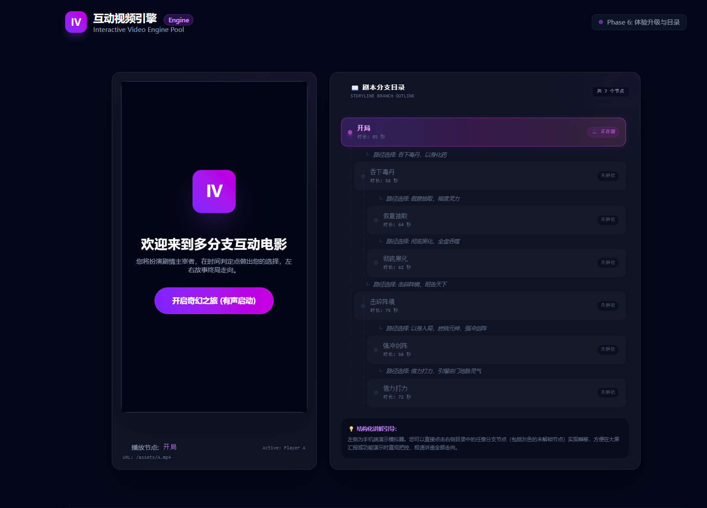
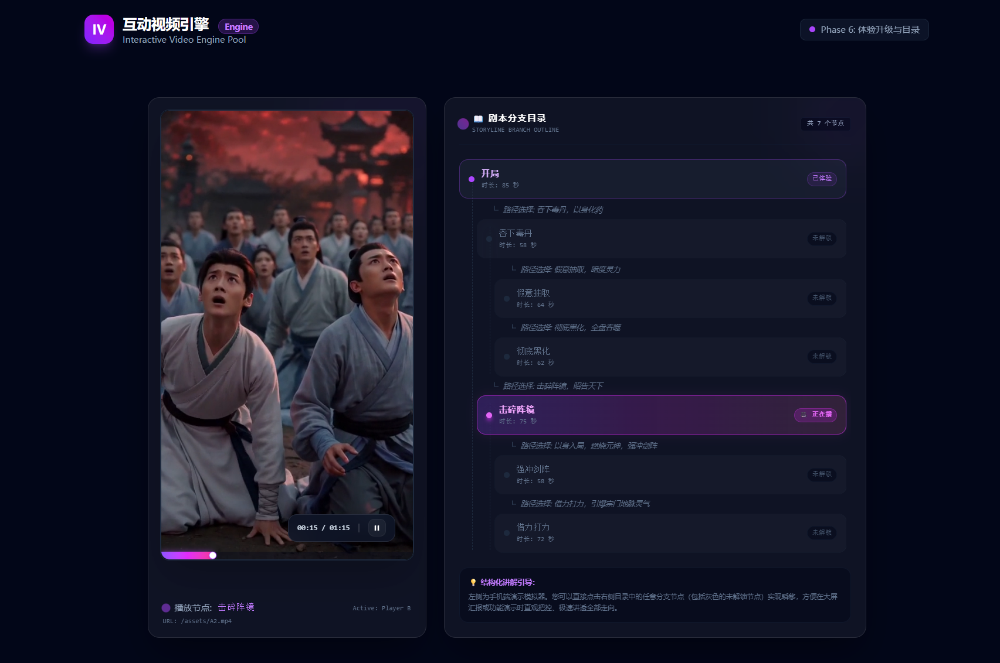

# 🎬 Seamless Interactive Video Engine

> **基于双播放器交替预载与瞬间物理对调技术的数据驱动互动视频引擎。**  
> 致力于解决单 Video 实例在多分支切换时的**黑屏、卡顿与音频爆音**顽疾，达成**物理切换时差 < 30ms** 的院线级极致流畅感。



---

## 🌟 核心技术突破与亮点

本引擎由底层逻辑管理器、媒体控制器与上层交互视图完全解耦而成，具备多项工业级高可用设计：

*   **⚡ 双播放器 DOM 回收池 (Dual-Player DOM Recycling)**
    常驻 Video A 与 Video B 两个物理实例。当 A 在前台播放且接近交互判定点时，B 在后台静默对目标分支进行 `Proximity Preload`（临近预加载），并 pause 在 `0.0s` 处挂起，实现物理占位。
*   **🎯 requestAnimationFrame 瞬间硬切**
    在分支决定的黄金微秒，利用下一帧渲染时机执行绝对 `z-index` 与 `opacity` 的对调（切换时差压制在 10ms 以内），无感衔接，实现肉眼零黑帧。
*   **🔊 Cross-fade 音频平滑淡入**
    在物理切换的 120ms 窗口内对新通道实施音量渐入，旧通道渐出并施加 `Explicit Mute Lock`（双重绝对静音锁），彻底抹除传统流切换时的爆音（Pop noise）。
*   **📊 极客调试控制面板 (Debug Drawer)**
    内嵌磨砂玻璃（Glassmorphism）高颜值系统控制抽屉。集成**实时切换时延 Benchmarking 看板**（毫秒级浮点打点）、**有声首播启动遮罩**、**剧情拓扑小地图**以及倒计时进度条。
*   **🧪 10s 超时兜底与原子锁**
    10秒未选择时，系统自动单向激活 `isLocked` 防重复原子锁，安全超时静默物理流转至 `defaultNextNodeId` 默认分支。
*   **📱 移动端体验响应式升级**
    *   **控制面板常驻**：针对手机等触屏设备，移除了 hover 机制，将底部播放/暂停及时间进度控制条设为移动端默认常驻显示（`opacity-100`），仅在宽屏桌面端保持悬停显示，极大提升了移动端操纵体验。
    *   **大屏卡片等高对齐**：移除了剧本目录卡片的硬性最大高度限制，在桌面端（`md:` 及以上）通过弹性布局自动跟左侧播放器等高对齐，界面排版更加严谨高级。

### ⚙️ 核心无缝切换流程示意

下面是双播放器后台静默预载与前后台瞬间物理硬切的交互流程图：



---

## 🛠️ 技术栈堆栈

*   **核心媒体**: [Shaka Player](https://github.com/shaka-project/shaka-player) (配置优化缓冲 `bufferingGoal: 6s`) / HTML5 Video
*   **前端逻辑**: React 19 / TypeScript 6.0 / Tailwind CSS
*   **构建工具**: Vite 8.0 / Autoprefixer / PostCSS
*   **测试框架**: Vitest (100% 高仿真 JSDOM 多媒体事件驱动集成测试)

---

## 💿 快速开始

### 1. 克隆并安装依赖
```bash
git clone https://github.com/guochaopeng110-maker/interactive-video-playground.git
cd interactive-video-playground
npm install
```

### 2. 启动本地开发服务
```bash
npm run dev
```
启动后访问控制台输出的本地端口。点击 **“开启奇幻之旅 (有声启动)”** 即可开始有声首播。拉开右侧发光拉条，可实时查看系统运行状态及剧情拓扑网络。

### 3. 运行自动化集成测试
```bash
npm run test
```
本套单测完美 Mock 了 Shaka 播放器，并高仿真模拟了 HTML5 Video 的 `timeupdate` 与 `canplaythrough` 微任务管道：
*   `InteractionContainer.test.tsx` (5/5 单元测试通过)
*   `FullStoryFlow.test.tsx` (2/2 全链路集成测试通过，包含超时与时延打点捕获)

### 4. 生产环境打包编译
```bash
npm run build
```

---

## 📑 工业级 FFmpeg 无缝转码规范

为了保证分支视频的 GOP（图片群组）在物理切入点绝对对齐，避免因 Open GOP 或可变帧率导致切换闪烁，所有入库资产必须遵循以下转码标准：

```bash
ffmpeg -i input.mp4 \
  -c:v libx264 -profile:v high -level:v 4.1 \
  -preset:v slow -crf 20 \
  -maxrate 4M -bufsize 8M \
  -r 30 -g 60 -keyint_min 60 -sc_threshold 0 -bf 2 \
  -c:a aac -b:a 192k -ar 48000 -ac 2 \
  -movflags +faststart \
  output.mp4
```

### 关键参数解析：
*   **`-g 60 -keyint_min 60`**: 严格锁定 GOP 长度为 60 帧（30fps 下即 2.0 秒），确保切换点均在关键帧（I-Frame）上。
*   **`-sc_threshold 0`**: **禁用场景检测**。防止 FFmpeg 在镜头突变处额外插入非周期性 I 帧，确保多分支素材物理帧位置绝对重合。
*   **`-movflags +faststart`**: 将元数据 moov atom 移至文件头，支持流“首帧秒开”，极速触发预载 canplaythrough。

详细压制指南请参阅：📄 **[FFmpeg 工业转码指南](file:///.planning/phases/05-assets-uat/FFMPEG-GUIDE.md)**。

---

## 📂 项目关键目录结构

```text
├── .planning/               # GSD 里程碑与设计文档 (PROJECT/ROADMAP/STATE)
│   └── phases/05-assets-uat/ # Phase 5 转码指南及 UAT 汇总
├── docs/
│   └── images/              # 项目架构流程图与界面截图资源 (main.png / process.png)
├── public/
│   ├── assets/              # 本地测试多媒体资产 (intro/branch_a/branch_b)
│   └── storyConfig.json     # 数据驱动剧情树路由契约
├── src/
│   ├── components/          # 核心交互解耦组件
│   │   ├── InteractivePlayer.tsx       # 双播放器物理层叠与瞬间硬切算法
│   │   ├── InteractionContainer.tsx    # 倒计时原子锁交互 Overlay 
│   │   ├── DebugDrawer.tsx             # 极客 Benchmarking 控制面板
│   │   ├── StoryCatalog.tsx            # 常驻树状剧本章节目录 (Phase 6 新增)
│   │   └── StoryNodeGraph.tsx          # 拓扑连线小地图
│   ├── engine/              # 底层事件管理器
│   │   ├── NodeStateManager.ts         # 状态机逻辑控制器
│   │   └── types.ts                    # 引擎静态类型
│   └── test/                # 测试配置 setup.ts
└── package.json
```

---

## 📄 开源许可证

本项目基于 MIT License 开源。
